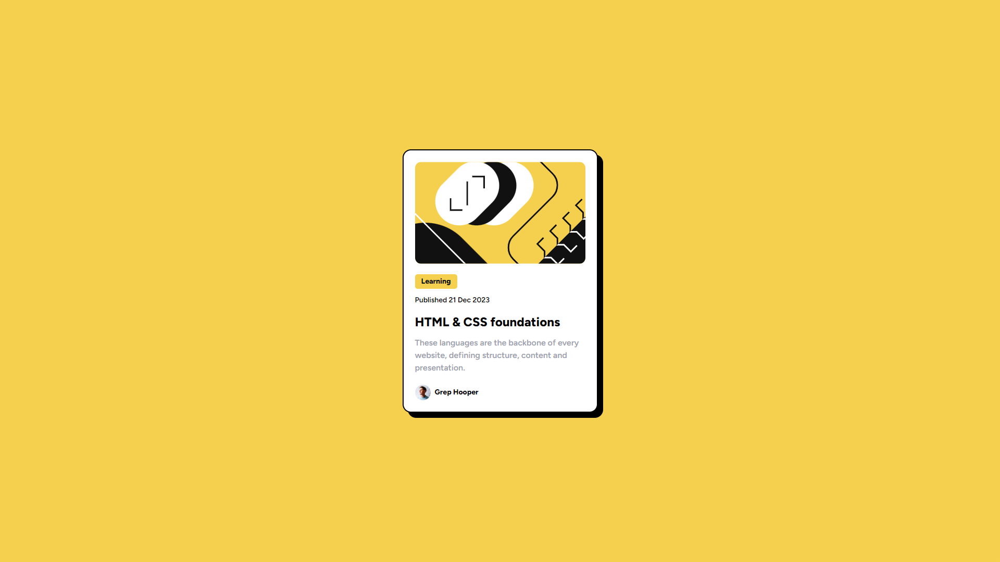

# Frontend Mentor - Blog preview card solution

This is a solution to the [Blog preview card challenge on Frontend Mentor](https://www.frontendmentor.io/challenges/blog-preview-card-ckPaj01IcS). Frontend Mentor challenges help you improve your coding skills by building realistic projects.

## Table of contents

- [Frontend Mentor - Blog preview card solution](#frontend-mentor---blog-preview-card-solution)
  - [Table of contents](#table-of-contents)
  - [Screenshot](#screenshot)
  - [Links](#links)
  - [Built with](#built-with)
  - [Author](#author)

## Screenshot

## Links

- Solution URL: [Add solution URL here](https://github.com/HarikrishnanYPR1707/blog-preview-card-main)
- Live Site URL: [Add live site URL here](https://blog-preview-card-b62tw1xfm-harikrishnanypr1707.vercel.app/)

## Built with

- Semantic JSX markup
- Flexbox
- CSS Grid
- Mobile-first workflow
- [React](https://reactjs.org/) - JS library
- [TailwindCSS](https://tailwindcss.com/) - For styles

## Author

- Website - [Harikrishnan Prasannakumar](https://harikrishnanprasannakumar.vercel.app/)
- Frontend Mentor - [@HarikrishnanYPR1707](https://www.frontendmentor.io/profile/HarikrishnanYPR1707)
- Twitter - [@Harikrishn54947](https://twitter.com/Harikrishn54947)
